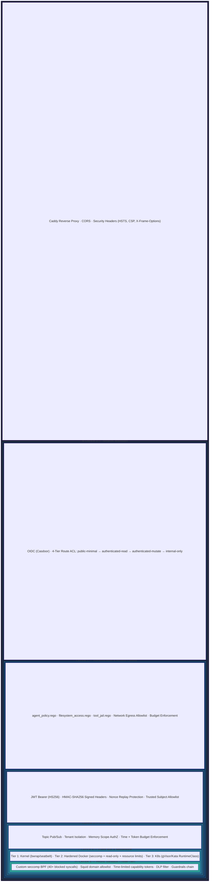
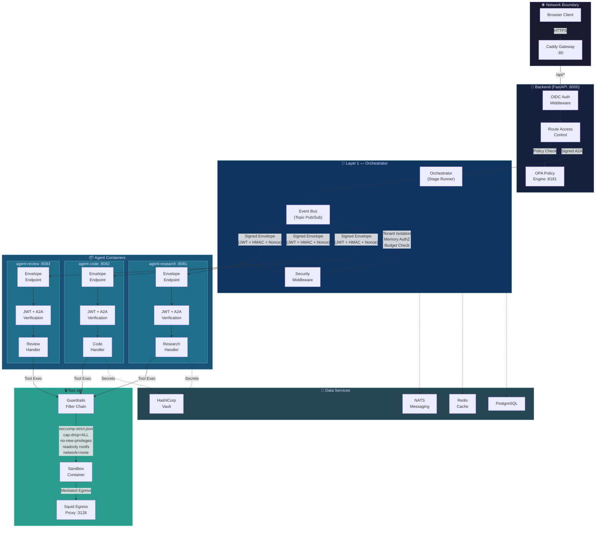
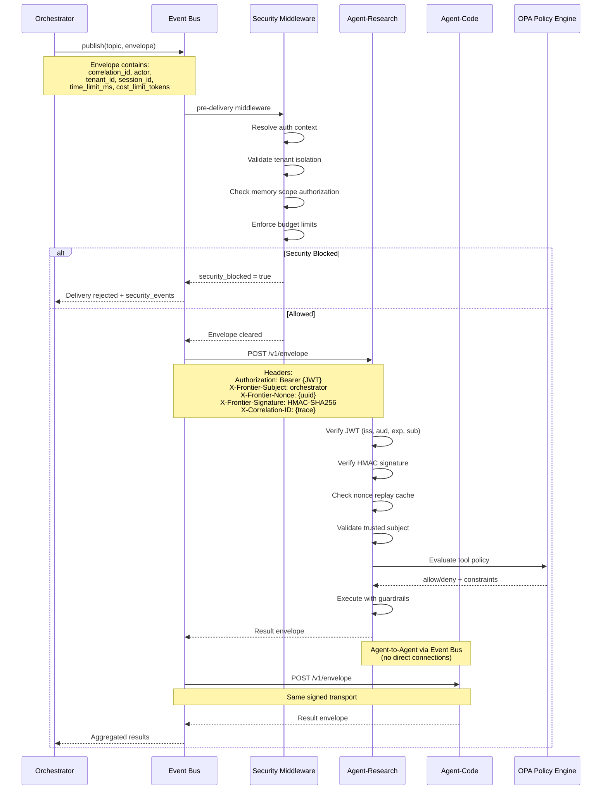

# Agent Isolation Layers & Multi-Agent Workflow Security

## Concentric Isolation Layers

## Multi-Agent Workflow Architecture

## Agent-to-Agent Envelope Security

## Runtime Profile Comparison

```mermaid
graph LR
    subgraph LW["local-lightweight"]
        LW1["Minimal auth"]
        LW2["Localhost binding"]
        LW3["No strict headers"]
        LW4["Dev convenience"]
    end

    subgraph LS["local-secure"]
        LS1["Full auth stack"]
        LS2["A2A signed transport"]
        LS3["OPA policy enforcement"]
        LS4["Hardened Docker sandbox"]
        LS5["Custom seccomp profile"]
        LS6["Squid domain allowlist"]
        LS7["Tenant isolation"]
    end

    subgraph H["hosted"]
        H1["HTTPS-only A2A"]
        H2["TLS cert verification"]
        H3["Strict replay protection"]
        H4["No localhost exceptions"]
        H5["Full identity enforcement"]
        H6["gVisor/Kata RuntimeClass"]
        H7["K8s seccomp + network policies"]
    end

    LW -->|"Hardened"| LS
    LS -->|"Production"| H

    style LW fill:#f4a261,color:#1a1a2e,stroke:#e76f51
    style LS fill:#2a9d8f,color:#1a1a2e,stroke:#264653
    style H fill:#264653,color:#e0e0ff,stroke:#2a9d8f
```

## Memory Scope Authorization Matrix

```mermaid
graph TD
    subgraph Scopes["Memory Scope Hierarchy"]
        G["🌍 global\n(internal_service only)"]
        R["🔄 run\n(internal_service only)"]
        W["⚙️ workflow\n(internal_service OR authenticated actor)"]
        AG["🤖 agent\n(internal_service OR actor with membership)"]
        T["🏢 tenant\n(matching tenant claim required)"]
        U["👤 user\n(authenticated actor)"]
        S["📋 session\n(session_id OR actor match)"]
    end

    G --> R
    R --> W
    W --> AG
    AG --> T
    T --> U
    U --> S

    style G fill:#e76f51,color:#fff,stroke:#c44536
    style R fill:#f4a261,color:#1a1a2e,stroke:#e76f51
    style W fill:#e9c46a,color:#1a1a2e,stroke:#f4a261
    style AG fill:#2a9d8f,color:#fff,stroke:#264653
    style T fill:#264653,color:#e0e0ff,stroke:#2a9d8f
    style U fill:#1a5276,color:#e0e0ff,stroke:#264653
    style S fill:#0f3460,color:#e0e0ff,stroke:#1a5276
```

