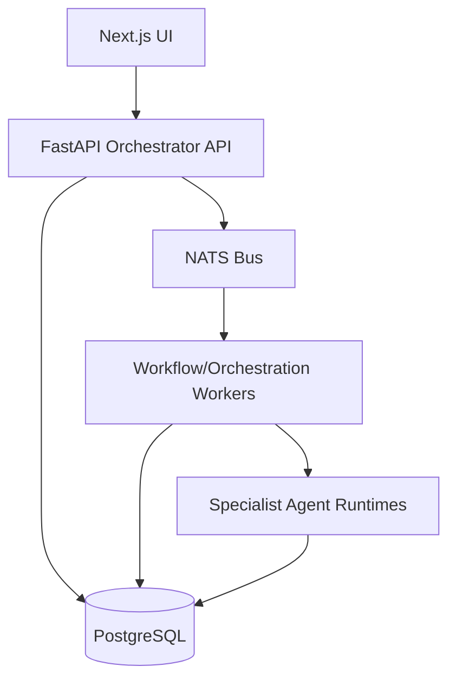

# Lattix xFrontier Architecture

> Historical reference note: this document captures an earlier planning snapshot. Treat it as background context only. The canonical current-state architecture for this repository now lives in `THREAT-MODEL.md` and `docs/ARCHITECTURE.md`.

## Scope
This document defines the architecture for Lattix xFrontier with a local-first MVP and a future path to AKS (managed under Rancher Fleet).

The product goal is to cover all business functions with AI agents that assist humans across sales, security/compliance, marketing, finance, product/development, legal, personnel, research, and contracting.

## Product Intent

- Users always interact with a single Orchestrator Agent entrypoint.
- The Orchestrator routes work to the correct specialist agents and workflows.
- Human oversight is enforced based on action risk and domain policy.
- Autonomy mode is configurable: start semi-autonomous, then move toward high-autonomous after trust is earned.

## Confirmed MVP Decisions

- Deployment mode: local on Windows desktop (WSL2/Docker Desktop allowed).
- Initial user model: local accounts with roles.
- MVP focus domains: sales, security/compliance, marketing.
- MVP workflow target: 3 live workflows per focus domain (9 total).
- Integration scope for MVP phase 1: no external tool calls yet; orchestrated chat-only workflows.
- Interface requirements (all in MVP):
  - Agent catalog
  - Historical runs by user
  - Live tasks board (queued/running/failed/completed)
  - Task timeline (steps/messages/approvals)
  - Search/filter
  - Cancel/retry actions
- Messaging backbone: NATS.
- Backend: Python + FastAPI.
- Frontend: Next.js.
- Rollback policy for deploy/remediation class actions: health checks + smoke tests.
- Data retention for MVP: indefinite retention, on-demand restore anytime.

## Architecture Overview

### 1. Orchestration Layer

Responsibilities:

- Receive all user requests.
- Normalize intent into workflow goals.
- Select agent groups and execute multi-agent choreography.
- Track run state, budgets, and policy checkpoints.
- Manage approval gates.

Implementation direction:

- FastAPI orchestration service.
- Workflow engine over NATS events.
- Registry-driven agent selection from `agents/REGISTRY/agents.registry.json`.

### 2. Policy and Approval Layer

Responsibilities:

- Evaluate policy before any high-impact action class.
- Enforce role-based access and approval routing.
- Maintain immutable decision logs.

Initial policy profile:

- External comms: human approve/correct once, then auto draft/send behavior is allowed in later tool-enabled phases.
- Financial decisions/transactions: always human-executed.
- Legal/contract outputs: AI-generated, human-approved.
- Personnel actions: AI stages, human approves/executes.
- Security remediation and deploy/infra actions: allowed only with health+smoke rollback safeguards (tool-enabled phase).

### 3. Execution Layer

MVP phase 1:

- Chat-only execution (no external tools).
- Agent outputs are structured artifacts/messages only.

Future phase:

- Introduce execution gateway with schema-validated commands.
- Route to sandboxed executors (browser/CLI/API) with strict policy gates.

### 4. Data and State Layer

Primary recommendation: PostgreSQL for MVP and near-term scale.

Why PostgreSQL first:

- Best fit for workflow state, users/roles, approvals, run history, and audit events.
- Strong transactional guarantees for orchestration and approval correctness.
- JSONB supports flexible payloads without losing SQL querying.
- Works cleanly with FastAPI and local Docker.
- Can later add `pgvector` for retrieval use cases.

When to add other databases:

- Neo4j: only if graph traversal becomes a hard bottleneck for agent relationship/path queries.
- MongoDB: only if workload becomes predominantly schema-less document throughput and SQL relations are no longer central.

Decision:

- MVP uses PostgreSQL as system of record.
- Reassess polyglot persistence after real usage telemetry.

## Local MVP Runtime Topology

Notes:

- All requests enter through Orchestrator APIs.
- Agent runs are evented over NATS.
- UI reads current and historical run state from API-backed Postgres.

## MVP UI Functional Model

Core screens:

- Inbox / New Task: submit to Orchestrator only.
- Live Task Board: queued/running/failed/completed with refresh/streaming updates.
- Run Detail: timeline of agent handoffs, decisions, artifacts, approvals.
- Agent Catalog: available agents, domain tags, status.
- History: searchable/filterable historical runs by user/domain/status/date.

Core actions:

- Start task
- Cancel task
- Retry task
- Approve/reject gated steps

## Security and Governance Baseline

- Local auth with role model (`admin`, `operator`, `viewer` to start).
- All run actions include correlation IDs for traceability.
- Immutable audit log table for:
  - user action
  - orchestrator decision
  - agent output
  - approval decision
  - retry/cancel events

## Evolution Path to Production

### Phase 1: Local MVP (current target)

- Orchestrated chat-only workflows.
- 9 workflows live across sales/security-marketing focus.
- Full UI visibility for current + historical runs.

### Phase 2: Controlled tool enablement

- Add execution gateway and command schemas.
- Start with low-risk integrations first.
- Introduce policy-enforced action execution and rollback checks.

### Historical phase 3 direction: Azure + AKS + Rancher Fleet

- Split platform into containerized planes: frontend, backend, workers, data.
- Deploy on AKS clusters managed via Rancher Fleet GitOps.
- Add enterprise identity provider integration and environment promotion controls.

## Historical repository strategy note

This section originally described an umbrella-repo + submodule migration plan. The current repository no longer uses that plan as its canonical structure. Use the live repository layout and migration notes in the root docs instead of treating the submodule strategy here as active guidance.

## Open Decisions

- Exact local auth provider/library implementation.
- Exact Postgres schema split (operational vs audit tables).
- Event versioning strategy for NATS subjects.
- Workflow DSL shape for authoring the initial 9 workflows.

## Build Start Checklist

- Lock MVP workflow list (3 per focus domain).
- Define role matrix and permission model.
- Create initial DB schema for users, runs, tasks, approvals, audit events.
- Define NATS subject taxonomy for orchestrator and agent events.
- Implement Orchestrator API and run-state lifecycle.
- Implement Next.js UI with live board + history + task detail timeline.
